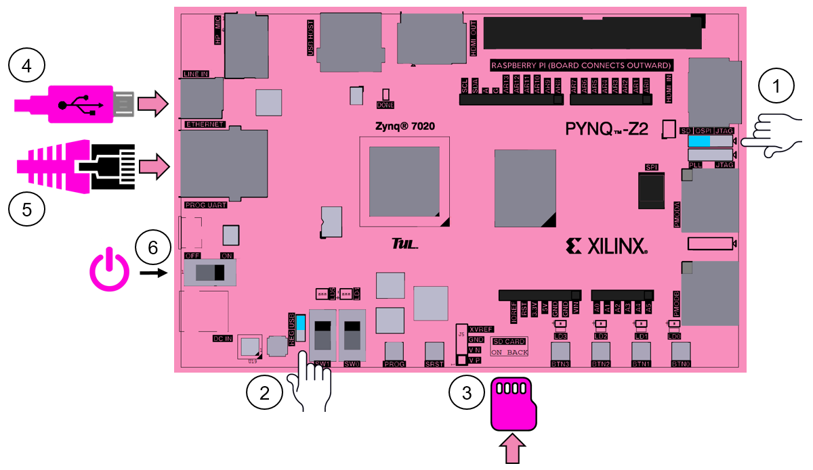

```
MIT License

Copyright (c) 2023 Damien Morlier Lin Yudong Morgan Adamsson Samuel Svensson Matteo Rodriguez Derek Holzer

Permission is hereby granted, free of charge, to any person obtaining a copy
of this software and associated documentation files (the "Software"), to deal
in the Software without restriction, including without limitation the rights
to use, copy, modify, merge, publish, distribute, sublicense, and/or sell
copies of the Software, and to permit persons to whom the Software is
furnished to do so, subject to the following conditions:

The above copyright notice and this permission notice shall be included in all
copies or substantial portions of the Software.

THE SOFTWARE IS PROVIDED "AS IS", WITHOUT WARRANTY OF ANY KIND, EXPRESS OR
IMPLIED, INCLUDING BUT NOT LIMITED TO THE WARRANTIES OF MERCHANTABILITY,
FITNESS FOR A PARTICULAR PURPOSE AND NONINFRINGEMENT. IN NO EVENT SHALL THE
AUTHORS OR COPYRIGHT HOLDERS BE LIABLE FOR ANY CLAIM, DAMAGES OR OTHER
LIABILITY, WHETHER IN AN ACTION OF CONTRACT, TORT OR OTHERWISE, ARISING FROM,
OUT OF OR IN CONNECTION WITH THE SOFTWARE OR THE USE OR OTHER DEALINGS IN THE
SOFTWARE.
```
# ScanProcessingFPGA

This project is an open-source project adaptating the Scanimate technology used in the 80s, the goal of this project was to design an hardware accelerator that would fit on a user-affordable FPGA to meet the PAL standards at 25 frames per second with being able to control it using OSC(Open Sound Control) messages.

For this project, we have used a Pynq Z2 board and a video DAC(Texas Instruments THS 8136), you'll find the ISO file for the pynq z2 board here : 

The DAC needing other components to work properly with the FPGA, we have created a kicad design than you can use to print a PCB board and don't need to figure about complex wiring.

So far the following elements have been implemented : 

- Function generators with modulable parameters including different waveforms(Sawtooth, Triangle, Sinewave) and frequency, phaseshift, harmonics
- HDMI Input read
- DAC output read
- Perspective processors
- Rotation processors
- Connexion matrix to connect the function generators between then to create complex X and Y ramps

Our project is free of use and modifying and licensed under the MIT license.

This project has been created at KTH by :

- Yudong Lin
- Matteo Rodriguez
- Samuel Svensson
- Morgan Adamsson
- Damien Morlier

Under the supervision of our tutor Derek Holzer

## Components to buy

- Pynq Z2 board : 
- THS8136 : 
- Boards files : 

## Installation




To install the project on the Pynq Z2 board :


- Set the jumper(1) to the SD side and plug in the USB powering and ethernet cable(4)(5)
- Get the ISO file of the board here : 
- Flash the SD card using Rufus(https://rufus.ie/fr/) or balena etcher(https://www.balena.io/etcher)
- Insert the SD card into the SD card slot of the FPGA board(3)

- Turn on the board

If you wish to power the FPGA board using a power supply, you need to switch the jumper(2)

After a few minutes, the led DONE on the board should turn on and the ethernet connexion should be appearing

## Sending OSC messages

In order to send OSC messages, your computer needs to be connected to the FPGA via the ethernet cable, then you can use every OSC interface you have(or use python-osc to code in python)

Interface setup : 

- IP : 
- Port : 

Then you can send OSC messages to the board, you can find a detailed description of the available messages at the bottom of the page

## Edit the Project

In order to edit the project, you'll need the version 2022.1 of Vivado that you can find here :

Any others versions of the tool would not be able to open the project.

Then clone the following repo : 

In vivado, select Run TCL Script and then run build_ip.tcl in the repo


Then you can run the build_project.tcl script from this repo and the architecture and block design of the project should open to you


The HDMI pipeline should not be severely transformed for the integrity of the project

Our implementation of the Scanimate is located inside of the IP Datapath_DMA

After editing the project, you can then generate the bitstream and replace the board bitstream located here 

And reboot the board

## Adding Hardware Modules

If you wish to modify the project and add some custom written blocks, you'll need to have knowledge in hardware description languages(VHDL, Verilog, SystemVerilog) and knowledge in digital design and expertise in using Vivado


## How to use GHDL to simulate


Here is a quick tutorial on using an open-source tool to simulate your written modules in hardware description languages
### Installation :
```bash
sudo apt-get install ghdl
```

### Analyse :

```bash
ghdl -a all-your-files
```

### Elaborate :


```bash
ghdl -e top-entity
```

### Run :

```bash
ghdl -r top-entity --wave=PathToResults\Name_wave.ghw

```

Then you can use gtkwave to visualize your tests

### Automatically run test bench

```
./run_testbench.sh run <test-bench-entity>
```

## Roadmap

Here is a list of modules that could be implemented to enhance the experience on the project

- Add an ADC input to have a external input to the connexion matrix
- Implement the HDMI output


## Ressources

- Detailed description of the OSC implemented : https://www.overleaf.com/read/ynmztfjhcprb

- Technical Report : 